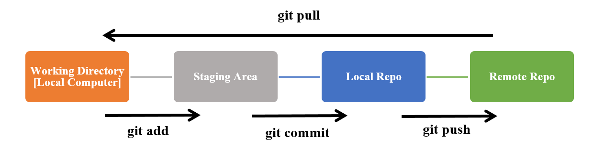
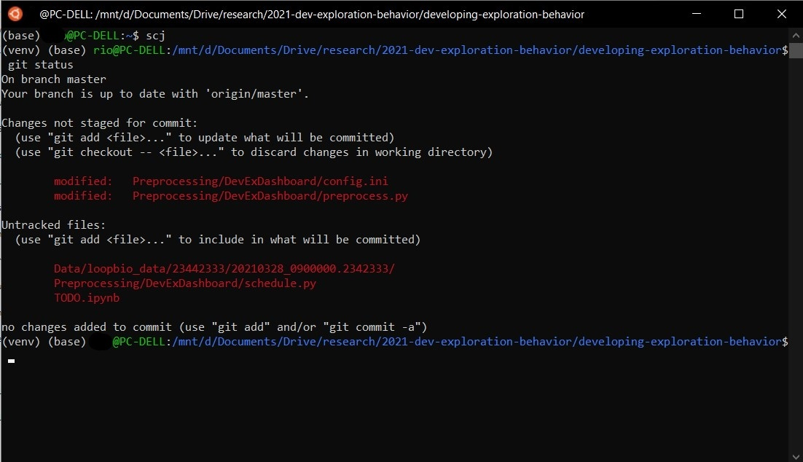
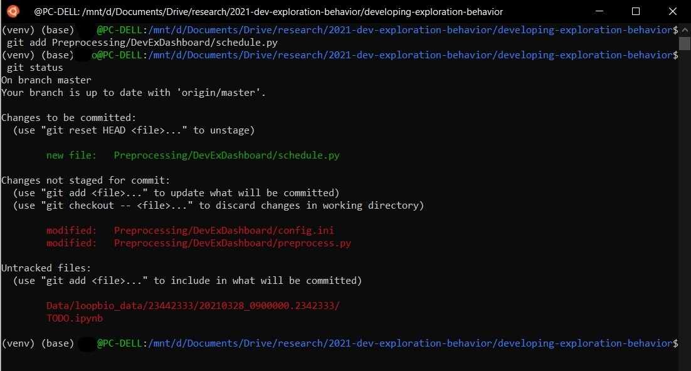
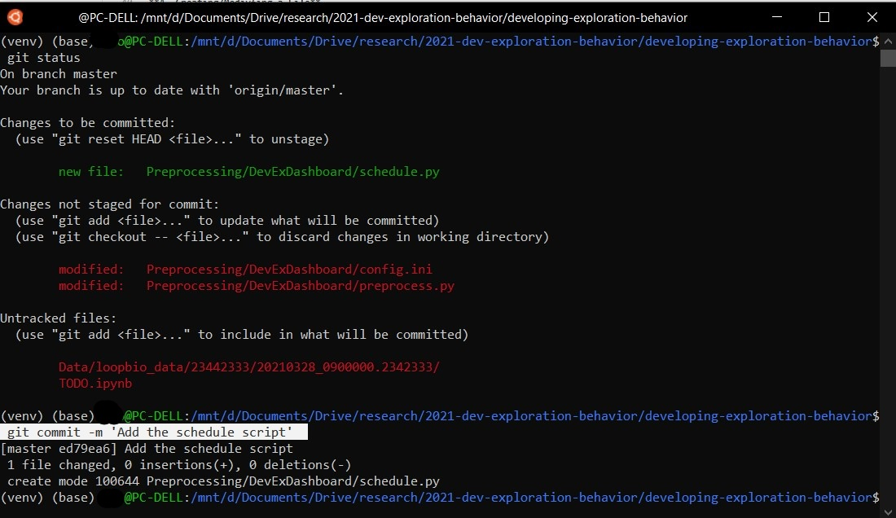

# Git and Github User Guide

This user guide is specifically tailored to the suit the needs of those contributing code to this repository. It aims to provides a succinct summary that ommits basic Git commands that you will likley not need for contributing to this project, hence it should not be used as a definitive reference for interacting with GitHub and Git more generally.

## What is GitHub?

In simple terms, GitHub is a code sharing site; it can be tought of a combination of a cloud storage platform and a back-up service for all of your programming needs
(similar to Google Drive). To create a GitHub account, [sign up here](https://github.com/join).

More technically, GitHub is a Git repository hosting service. A repository (or repo) can be thought of like a directory on your local computer; 
it tracks all changes made to files in your project, building a history over time. Perhaps unsurprisingly, a project (like this one) is generally also formed of a local directory—a directory/folder 
for storing your files on your computer. A Git repository is where these files and changes are tracked on GitHub.

## What is Git?
At the centre of GitHub is Git, an open source project started by Linux creator Linus Torvalds. Git is a Version Control System (VCS), a category of software tools that help 
teams manage changes to source code over time. VSCs keep track of every modification to the code in a special kind of database. It’s a filing system for every draft of a document.


### Using Git

Git can be used using a web interface or a command line; this document focues on the command (cmd) line using a terminal (click [here to install Git](https://git-scm.com/book/en/v2/Getting-Started-Installing-Git) if you haven't done so already).

The general workflow of GitHub is represented in the diagram below. The black arrows are the commands that can be directly inputted into a terminal:



Each of these commands will be outlined in more detail in the below summary of the 3 main steps that you will need to learn in order to start contributing to this repository:

### 1. Cloning this Repository

You can start contributing to a GitHub project either by creating a local repo or cloning an existing repo. Since this document is just intended to help you contribute to this repository, we will only cover on the latter.

So what does 'cloning a repository' means? It equates to making a full copy of ('pulling') all the repository data that GitHub has at that point in time, including all versions of every file and folder for the project. At any point, you can push your changes to the remote repository on GitHub, or pull other people's changes from GitHub

To clone the repository using HTTPS, under "Clone with HTTPS", click 📋. To clone the repository using an SSH key, including a certificate issued by your organization's SSH certificate authority, click Use SSH, then click 📋.

Open your terminal and change the current working directory to the location where you want the cloned directory (cd).

Type `git clone`, and then paste the URL you copied earlier. Then press Enter to create your local clone.

### 2. Adding a New File to the Repository

**A. Creating/Modiyfing a File**

Once you've added or modified files in a folder containing a git repo, git will notice that changes have been made inside the repo. But, git won't officially keep track of the file (that is, put it in a commit; more on this next) unless you explicitly tell it to.

After creating the new file, you can use the `git status` command to see which files git knows exist.



What this basically says is, "Hey, we noticed you created a new file called hello_world.txt, but unless you use the 'git add' command we aren't going to do anything with it."

**B. Adding a File to the Staging Environment**

Once you've created/modified the file, you need to add it to the so-called staging environment, it is an environment for testing that exactly resembles a production environment (i.e. the repository before your change it made), using the `git add` command:



This command can be run with a number of [optional arguments](https://git-scm.com/docs/git-add). For instance, if you simply modify one or multiple files that are already being tracked and part of this repo, you should simply run `git add -u` (where `-u` is short for `--update`) which updates all files that are already being tracked but which you have updated. 

**C. Adding a Commit Message**

Next you need to commit the file. To do so run the command `git commit -m "Your message about the commit"`. 



The message at the end of the commit should be something related to what the commit contains. For instructions on commit messages, refer to the section on [writing a commit message](#writing-a-commit-message)

**D. Pushing the File to the Repo**

Now we'll push the commit in your branch to the repo. This allows other people to see the changes you've made.  

To push changes onto a new branch on GitHub, you'll want to run `git push origin`. GitHub will automatically create the branch for you on the remote repository.

### 3. Getting Repository Changes Back to Your Computer

In order to get the most recent changes that you or others have merged on GitHub, use the command `git pull` (when working on the master branch). 
 
This shows you all the files that have changed and how they've changed.

Now we can use the git log command again to see all new commits.

### Writing a Commit Message

In general, a commit message should be a short (72 chars or less) summary. Even detailed explanatory text should be capped at this. However, longer messages should have a subject line, followed by a blank line that seperates it from the main body - unless you omit the body entirely.

As a rule of thumb, a properly formed git commit subject line should always be able to complete the following sentence:

> *If applied, this commit will \<your subject line here>\*

A full checklist of reminders to adhere to may be summarized as follows:

* Separate subject from body with a blank line
* Do not end the subject line with a period
* Capitalize the subject line and each paragraph
* Use the imperative mood in the subject line
* Wrap lines at 72 characters
* Use the body to explain what and why you have done something. In most cases, you can leave out details about how a change has been made.

##### Example
```
Add commit message guidance

Put together a document that [...]
```

### Summary of Key Terms
The definitions below will help you follow the instructions to set up GitHub and Git and troubleshoot any problems you may have. These terms aren’t specific to GitHub; they are used anywhere that employs Git:

**Branch**
> A version of the repository that diverges from the main working project. Branches can be a new version of a repository, experimental changes, or personal forks of a repository for users to alter and test changes.

**Clone**
> A clone is a copy of a repository or the action of copying a repository. 

**Fetch**
> By performing a Git fetch, you are downloading and copying that branch’s files to your computer. Multiple branches can be fetched at once, and you can rename the branches when running the command to suit your needs.

**Fork**
> Creates a copy of a repository.

**HEAD**
> HEAD (capitals) is a reference variable used to denote the most current commit of the repository in which you are working. When you add a new commit, HEAD will then become that new commit.

**Master/Main**
>The primary branch of all repositories. All committed and accepted changes should be on the master branch. You can work directly from the master branch, or create other branches.

**Merge**
> Taking the changes from one branch and adding them into another (traditionally the master) branch. These commits are usually first requested via pull request before being merged by the user who maintains the project.

**Origin**
> The conventional name for the primary version of a repository. Git also uses origin as a system alias for pushing and fetching data to and from the primary branch. 

**Pull/Pull Request**
>If someone has changed code on a separate branch of a project and wants it to be reviewed to add to the master branch, that someone can put in a pull request. Pull requests ask the user who maintains the repo to review the commits made, and then, if acceptable, merge the changes upstream. A pull happens when adding the changes to the master branch.

**Push**
> Updates a remote branch with the commits made to the current branch. You are literally “pushing” your changes onto the remote.

**Remote**
> A copy of the original branch. When you clone a branch, that new branch is a remote, or clone. Remotes can talk to the origin branch, as well as other remotes for the repository, to make communication between working branches easier.

**Upstream**
> While there is not necessarily a default “upstream” or “downstream” for Git projects, upstream can be considered where you push your Git changes — this is often the master branch of the project within the origin

## Further Resources

* [Git everyday](https://git-scm.com/docs/everyday) (list of essential Git commands).
* [Pro Git](https://git-scm.com/book/en/v2) (the entire Pro Git book, written by Scott Chacon and Ben Straub and published by Apres).

## Sources

* https://github.com/SianJMBrooke/Introduction_To_Git
